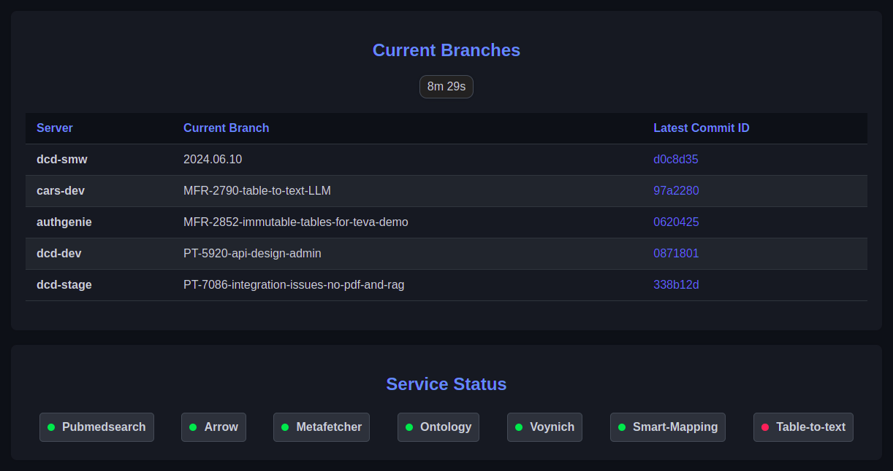

# Status Fetch

**Status Fetch** is a script designed to generate a comprehensive status page for monitoring Git repositories and external services across multiple servers. This script performs two main tasks:

1. **List Branches and Commit IDs:** The script SSHs into all specified servers, executes Git commands to fetch branch names and their corresponding commit IDs, and compiles the information.
2. **External Service Status Monitoring:** The script checks the status of various external services. This requires input from another confidential script or URL, which is not included in this module. The data retrieved from this service is crucial for the script’s functionality.
   
>**Note:** The script generates an `index.html` file containing the compiled status information, which can be served via Nginx or another web server to provide a live status page. There is a timer with 10 minutes running at the top which will automatically re-run the code to get the latest changes (done by cronjob to run the code at every 10 minutes intervals)

## Features
- **Automated Git Repository Status Tracking:** Lists all branches and their latest commit IDs across multiple servers.
- **External Service Monitoring:** Integrates with an external, confidential service to track the status of critical services.
- **HTML Output:** Generates a user-friendly index.html file for easy access to status information via a web browser.

## How It Works
1. **SSH into Servers:** The script securely SSHs into each server specified in the configuration.
2. **Run Git Commands:** It runs a set of Git commands to fetch the branch names and their latest commit IDs.
3. **Fetch External Service Status:** The script makes a request to a confidential URL or script to gather the status of external services.
4. **Generate HTML:** All gathered information is compiled and exported into an index.html template.
5. **Serve via Nginx:** The generated index.html file can be served using Nginx or any web server as a live status page.

## Prerequisites
- **SSH Access:** Ensure the script has SSH access to all relevant servers.
- **Confidential Input:** The script requires an external URL or service that provides necessary input. Ensure this is configured and accessible.
- **Web Server (e.g., Nginx):** To serve the generated index.html file.

## Usage
1. Clone this repository.
2. Configure SSH access and specify the servers in the script.
3. Ensure the external service or URL for fetching the status of services is properly set up.
4. Run the script to generate the index.html file.
5. Serve the index.html file via Nginx or another web server.

## Output
The script generates an index.html file that can be served as a status page. Below is a sample screenshot of the generated page:

## Security Considerations
- **Confidential Inputs:** Ensure that the confidential script or URL providing input is secure and accessible only by authorized users.
- **SSH Keys:** Use secure SSH keys for accessing servers. Avoid using password-based SSH authentication.

## Contact
For any questions or issues, please contact repo owner.